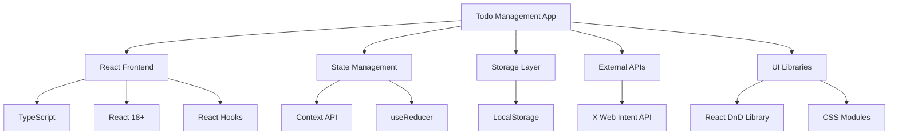
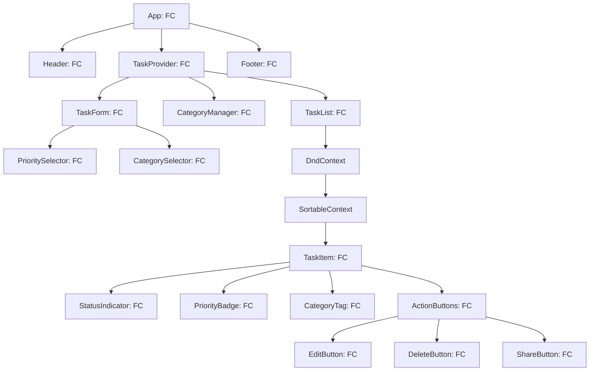
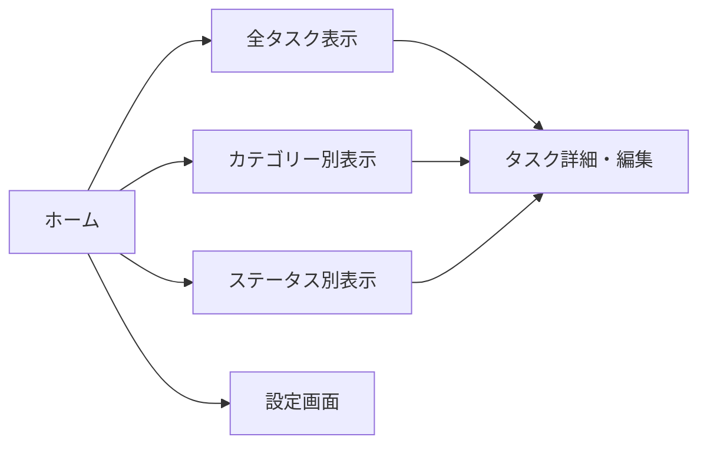
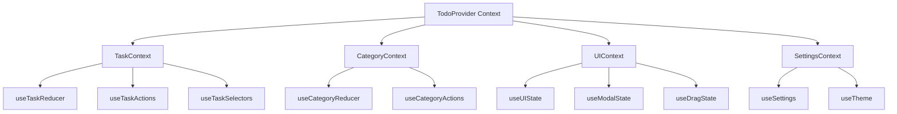
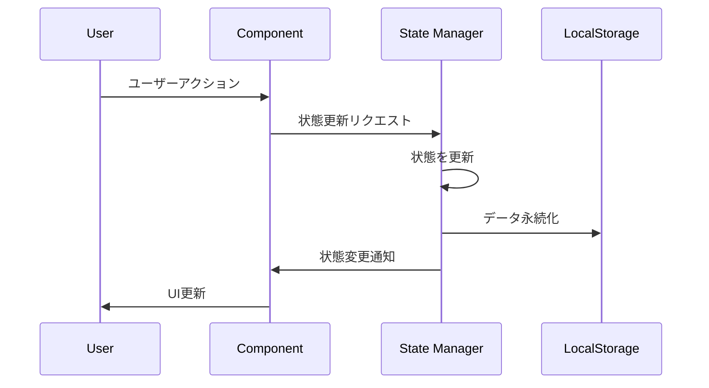
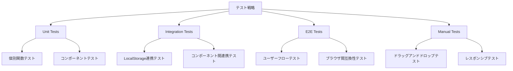
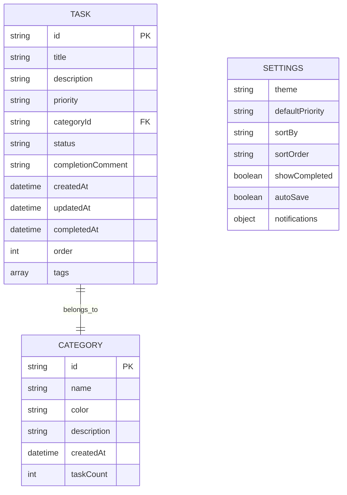
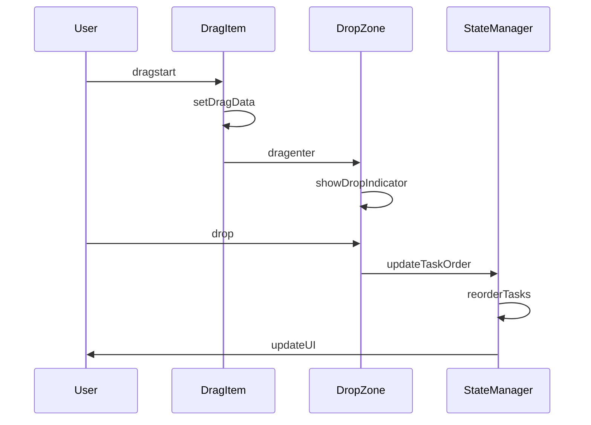
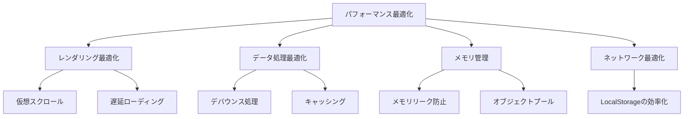

# Todo管理アプリ設計書

## 1. 概要

### 1.1 プロジェクト概要
高機能なTodo管理アプリケーションの開発。一般的なタスク管理機能に加え、優先度管理、カテゴリータグ、進捗追跡、業務記録、ドラッグアンドドロップによる並び替え、SNS連携機能を提供する。

### 1.2 主要機能
- タスクのCRUD操作
- 優先度設定（高・中・低）
- カスタムカテゴリータグ機能
- 進捗管理（未実行・実行中・完了）
- 完了時の業務記録コメント
- ドラッグアンドドロップによるタスク並び替え
- X（Twitter）への投稿機能
- ローカルストレージによるデータ永続化

### 1.3 技術スタック
- **フロントエンド**: React 18+, TypeScript 5+
- **UI Framework**: React (関数型コンポーネント + Hooks)
- **状態管理**: React Context API + useReducer
- **スタイリング**: CSS Modules または Styled Components
- **ストレージ**: LocalStorage
- **ドラッグアンドドロップ**: react-beautiful-dnd または @dnd-kit
- **SNS連携**: X（Twitter） Web Intent API
- **ビルドツール**: Vite または Create React App

## 2. 技術スタック・依存関係

### 2.1 コア技術


### 2.2 依存関係管理
```json
{
  "dependencies": {
    "react": "^18.2.0",
    "react-dom": "^18.2.0",
    "@dnd-kit/core": "^6.0.0",
    "@dnd-kit/sortable": "^7.0.0",
    "@dnd-kit/utilities": "^3.2.0"
  },
  "devDependencies": {
    "typescript": "^5.0.0",
    "@types/react": "^18.2.0",
    "@types/react-dom": "^18.2.0",
    "vite": "^4.0.0",
    "@vitejs/plugin-react": "^4.0.0"
  }
}
```
- TypeScript strict mode有効
- ESLint + Prettier設定
- React 18の並行機能活用

## 3. コンポーネント設計

### 3.1 コンポーネント階層


### 3.2 主要コンポーネント詳細

#### TaskItem Component
```typescript
// TypeScript型定義
interface Task {
  id: string;
  title: string;
  description: string;
  priority: 'high' | 'medium' | 'low';
  category: string;
  status: 'todo' | 'in-progress' | 'completed';
  completionComment: string;
  createdAt: Date;
  updatedAt: Date;
  completedAt: Date | null;
  order: number;
}

interface TaskItemProps {
  task: Task;
  onUpdate: (task: Task) => void;
  onDelete: (id: string) => void;
  onShare: (task: Task) => void;
}

const TaskItem: React.FC<TaskItemProps> = ({ task, onUpdate, onDelete, onShare }) => {
  // 関数型コンポーネント実装
};
```

#### CategoryManager Component
```typescript
interface Category {
  id: string;
  name: string;
  color: string;
  description?: string;
  createdAt: Date;
  taskCount: number;
}

interface CategoryManagerProps {
  categories: Category[];
  onCreateCategory: (category: Omit<Category, 'id' | 'createdAt' | 'taskCount'>) => void;
  onUpdateCategory: (category: Category) => void;
  onDeleteCategory: (id: string) => void;
}

const CategoryManager: React.FC<CategoryManagerProps> = (props) => {
  const [isCreating, setIsCreating] = useState(false);
  const [editingCategory, setEditingCategory] = useState<Category | null>(null);
  // カテゴリー管理ロジック
};
```

#### TaskForm Component
```typescript
interface TaskFormProps {
  task?: Task;
  categories: Category[];
  onSubmit: (task: Omit<Task, 'id' | 'createdAt' | 'updatedAt'>) => void;
  onCancel: () => void;
}

const TaskForm: React.FC<TaskFormProps> = ({ task, categories, onSubmit, onCancel }) => {
  const [formData, setFormData] = useState<TaskFormData>(initialFormData);
  const [errors, setErrors] = useState<ValidationErrors>({});
  
  // フォーム状態管理とバリデーション
};
```

## 4. ルーティング・ナビゲーション

### 4.1 ページ構成


### 4.2 フィルター機能
- ステータス別フィルター（未実行/実行中/完了）
- カテゴリー別フィルター
- 優先度別フィルター
- 検索機能（タイトル・説明文）

## 5. スタイリング戦略

### 5.1 CSS設計方針
- **方法論**: BEM記法採用
- **レスポンシブ**: Mobile First アプローチ
- **テーマ**: ライト/ダークモード対応
- **アニメーション**: CSS Transitions & Animations

### 5.2 UI/UXデザイン原則
- **直感的操作**: ドラッグアンドドロップの視覚的フィードバック
- **状態表示**: 進捗状態の明確な視覚化
- **アクセシビリティ**: キーボードナビゲーション対応
- **パフォーマンス**: 軽量なアニメーション

### 5.3 カラーパレット設計
```css
:root {
  /* Priority Colors */
  --priority-high: #ff4757;
  --priority-medium: #ffa502;
  --priority-low: #26de81;
  
  /* Status Colors */
  --status-todo: #a4b0be;
  --status-progress: #3742fa;
  --status-completed: #2ed573;
  
  /* Theme Colors */
  --primary: #2f3542;
  --secondary: #57606f;
  --background: #f1f2f6;
  --surface: #ffffff;
}
```

## 6. 状態管理

### 6.1 状態管理アーキテクチャ（React Context + useReducer）


### 6.2 状態管理パターン（Hooks中心）
```typescript
// グローバル状態管理
interface AppState {
  tasks: Task[];
  categories: Category[];
  ui: UIState;
  settings: Settings;
}

type AppAction = 
  | { type: 'ADD_TASK'; payload: Task }
  | { type: 'UPDATE_TASK'; payload: { id: string; updates: Partial<Task> } }
  | { type: 'DELETE_TASK'; payload: string }
  | { type: 'REORDER_TASKS'; payload: { activeId: string; overId: string } };

const appReducer = (state: AppState, action: AppAction): AppState => {
  // 不変性を保った状態更新
};

// カスタムHooks
const useTasks = () => {
  const { state, dispatch } = useContext(TodoContext);
  
  const addTask = useCallback((task: Omit<Task, 'id'>) => {
    dispatch({ type: 'ADD_TASK', payload: { ...task, id: generateId() } });
  }, [dispatch]);
  
  return { tasks: state.tasks, addTask };
};
```

### 6.3 データフロー


## 7. API統合レイヤー

### 7.1 ローカルストレージ API（関数型アプローチ）
```typescript
// LocalStorage操作のカスタムHooks
const useLocalStorage = <T>(key: string, initialValue: T) => {
  const [value, setValue] = useState<T>(() => {
    try {
      const item = window.localStorage.getItem(key);
      return item ? JSON.parse(item) : initialValue;
    } catch (error) {
      console.warn(`Error reading localStorage key "${key}":`, error);
      return initialValue;
    }
  });

  const setStoredValue = useCallback((newValue: T | ((val: T) => T)) => {
    try {
      const valueToStore = newValue instanceof Function ? newValue(value) : newValue;
      setValue(valueToStore);
      window.localStorage.setItem(key, JSON.stringify(valueToStore));
    } catch (error) {
      console.warn(`Error setting localStorage key "${key}":`, error);
    }
  }, [key, value]);

  return [value, setStoredValue] as const;
};

// 特化したストレージHooks
const useTaskStorage = () => {
  const [tasks, setTasks] = useLocalStorage<Task[]>('todo-tasks', []);
  return { tasks, setTasks };
};

const useCategoryStorage = () => {
  const [categories, setCategories] = useLocalStorage<Category[]>('todo-categories', []);
  return { categories, setCategories };
};
```
```

### 7.2 X（Twitter）連携 API（関数型アプローチ）
```typescript
// X投稿機能のカスタムHook
const useTwitterShare = () => {
  const formatTaskForShare = useCallback((task: Task): string => {
    const statusEmoji: Record<Task['status'], string> = {
      'todo': '📝',
      'in-progress': '⚡',
      'completed': '✅'
    };
    
    const statusText: Record<Task['status'], string> = {
      'todo': '未実行',
      'in-progress': '実行中', 
      'completed': '完了'
    };
    
    return `${statusEmoji[task.status]} ${task.title} - ${statusText[task.status]} #TodoApp`;
  }, []);

  const shareTask = useCallback((task: Task) => {
    const text = formatTaskForShare(task);
    const url = `https://twitter.com/intent/tweet?text=${encodeURIComponent(text)}`;
    const popup = window.open(
      url, 
      'twitter-share', 
      'width=600,height=400,scrollbars=yes,resizable=yes'
    );
    
    if (!popup) {
      console.warn('ポップアップがブロックされました');
    }
  }, [formatTaskForShare]);

  return { shareTask, formatTaskForShare };
};
```
```

### 7.3 データ同期・バックアップ
- LocalStorage容量制限対応
- データエクスポート機能（JSON形式）
- データインポート機能

## 8. テスト戦略

### 8.1 テスト種別


### 8.2 テスト対象機能
1. **CRUD操作テスト**
   - タスクの作成・読取・更新・削除
   - カテゴリーの管理操作

2. **ドラッグアンドドロップテスト**
   - タスクの並び替え機能
   - ステータス変更（ドロップによる）

3. **データ永続化テスト**
   - LocalStorageへの保存・読込
   - ブラウザリロード後のデータ保持

4. **フィルタリング・検索テスト**
   - 各種フィルター機能
   - 検索機能の精度

5. **SNS連携テスト**
   - X投稿機能
   - 投稿内容のフォーマット

### 8.3 テスト環境
- **ブラウザ**: Chrome, Firefox, Safari, Edge
- **デバイス**: デスクトップ, タブレット, モバイル
- **テストツール**: Jest（Unit）, Cypress（E2E）

## 9. データモデル設計（TypeScript Interface）

### 9.1 タスクデータモデル
```typescript
// Task インターフェース
interface Task {
  id: string;
  title: string;
  description: string;
  priority: 'high' | 'medium' | 'low';
  category: string;
  status: 'todo' | 'in-progress' | 'completed';
  completionComment: string;
  createdAt: Date;
  updatedAt: Date;
  completedAt: Date | null;
  order: number;
  tags: string[];
}

// Task作成用の型
type CreateTaskInput = Omit<Task, 'id' | 'createdAt' | 'updatedAt' | 'completedAt' | 'order'>;
type UpdateTaskInput = Partial<Omit<Task, 'id' | 'createdAt'>>;

// Task作成関数
const createTask = (input: CreateTaskInput): Task => ({
  ...input,
  id: crypto.randomUUID(),
  createdAt: new Date(),
  updatedAt: new Date(),
  completedAt: null,
  order: Date.now()
});
```

### 9.2 カテゴリーデータモデル
```typescript
// Category インターフェース
interface Category {
  id: string;
  name: string;
  color: string;
  description?: string;
  createdAt: Date;
  taskCount: number;
}

// Category作成用の型
type CreateCategoryInput = Omit<Category, 'id' | 'createdAt' | 'taskCount'>;

// Category作成関数
const createCategory = (input: CreateCategoryInput): Category => ({
  ...input,
  id: crypto.randomUUID(),
  createdAt: new Date(),
  taskCount: 0
});
```

### 9.3 設定データモデル
```typescript
// Settings インターフェース
interface Settings {
  theme: 'light' | 'dark';
  defaultPriority: Task['priority'];
  sortBy: 'createdAt' | 'priority' | 'title' | 'dueDate';
  sortOrder: 'asc' | 'desc';
  showCompleted: boolean;
  autoSave: boolean;
  notifications: {
    enabled: boolean;
    reminderTime: number; // minutes
  };
}

// デフォルト設定
const defaultSettings: Settings = {
  theme: 'light',
  defaultPriority: 'medium',
  sortBy: 'createdAt',
  sortOrder: 'desc',
  showCompleted: true,
  autoSave: true,
  notifications: {
    enabled: false,
    reminderTime: 60
  }
};
```

### 9.4 データリレーション


## 10. ドラッグアンドドロップ機能設計

### 10.1 ドラッグアンドドロップフロー


### 10.2 ドラッグ可能要素
- **タスクアイテム**: 並び順変更
- **ステータス間移動**: 未実行→実行中→完了
- **カテゴリー間移動**: タスクのカテゴリー変更

### 10.3 ドラッグアンドドロップ実装（@dnd-kit使用）
```typescript
// ドラッグアンドドロップの型定義
interface DragEndEvent {
  active: { id: string };
  over: { id: string } | null;
}

// メインのドラッグアンドドロップコンポーネント
const TaskDragAndDrop: React.FC<TaskDragAndDropProps> = ({ tasks, onReorder, onStatusChange }) => {
  const sensors = useSensors(
    useSensor(PointerSensor),
    useSensor(KeyboardSensor, {
      coordinateGetter: sortableKeyboardCoordinates,
    })
  );

  const handleDragEnd = useCallback((event: DragEndEvent) => {
    const { active, over } = event;
    
    if (!over) return;
    
    if (active.id !== over.id) {
      const activeIndex = tasks.findIndex(task => task.id === active.id);
      const overIndex = tasks.findIndex(task => task.id === over.id);
      
      if (activeIndex !== -1 && overIndex !== -1) {
        onReorder(arrayMove(tasks, activeIndex, overIndex));
      }
    }
  }, [tasks, onReorder]);

  return (
    <DndContext sensors={sensors} onDragEnd={handleDragEnd}>
      <SortableContext items={tasks.map(task => task.id)} strategy={verticalListSortingStrategy}>
        {tasks.map(task => (
          <SortableTaskItem key={task.id} task={task} />
        ))}
      </SortableContext>
    </DndContext>
  );
};

// ソート可能なタスクアイテム
const SortableTaskItem: React.FC<{ task: Task }> = ({ task }) => {
  const {
    attributes,
    listeners,
    setNodeRef,
    transform,
    transition,
  } = useSortable({ id: task.id });

  const style = {
    transform: CSS.Transform.toString(transform),
    transition,
  };

  return (
    <div ref={setNodeRef} style={style} {...attributes} {...listeners}>
      <TaskItem task={task} />
    </div>
  );
};
```

## 11. パフォーマンス最適化

### 11.1 最適化戦略


### 11.2 具体的な最適化手法
1. **大量タスク処理**
   - 仮想スクロール実装
   - ページネーション機能
   - 遅延レンダリング

2. **検索・フィルター処理**
   - デバウンス機能（300ms）
   - インデックス化された検索
   - キャッシュされたフィルター結果

3. **ドラッグアンドドロップ最適化**
   - RAF（RequestAnimationFrame）使用
   - GPU加速CSS transforms
   - イベントスロットリング

## 12. セキュリティ・プライバシー

### 12.1 データ保護
- **ローカルデータ**: LocalStorageの暗号化検討
- **機密情報**: パスワード等の機密情報は保存しない
- **データ漏洩防止**: XSS攻撃対策

### 12.2 X連携セキュリティ
- **Web Intent使用**: OAuth不要のセキュアな連携
- **データ送信制御**: 最小限の情報のみ送信
- **ユーザー制御**: 投稿前の確認ダイアログ

## 13. アクセシビリティ

### 13.1 WCAG 2.1準拠
- **キーボードナビゲーション**: Tab、Enter、Spaceキー操作
- **スクリーンリーダー対応**: ARIA属性の適切な使用
- **カラーコントラスト**: 4.5:1以上のコントラスト比
- **フォーカス管理**: 明確なフォーカスインディケーター

### 13.2 ユニバーサルデザイン
- **大きなタップターゲット**: 最小44px×44px
- **エラーメッセージ**: 明確で理解しやすい表示
- **代替テキスト**: 画像・アイコンの代替テキスト

## 14. 国際化・ローカライゼーション

### 14.1 多言語対応準備
```javascript
// i18n構造例
const messages = {
  ja: {
    task: {
      create: 'タスクを作成',
      edit: '編集',
      delete: '削除',
      complete: '完了'
    },
    priority: {
      high: '高',
      medium: '中',
      low: '低'
    }
  },
  en: {
    task: {
      create: 'Create Task',
      edit: 'Edit',
      delete: 'Delete',
      complete: 'Complete'
    }
  }
};
```

### 14.2 地域対応
- **日付フォーマット**: 地域に応じた日付表示
- **時刻表示**: 12時間制/24時間制切り替え
- **文字方向**: RTL言語対応準備

## 15. 機能拡張計画

### 15.1 Phase 2機能
- **通知機能**: ブラウザ通知API利用
- **リマインダー**: 期限前アラート
- **サブタスク**: 階層化されたタスク構造
- **添付ファイル**: 画像・ドキュメント添付

### 15.2 Phase 3機能
- **チーム機能**: タスク共有・割り当て
- **レポート**: 生産性分析・統計
- **API連携**: 外部サービス統合
- **PWA対応**: オフライン機能・インストール